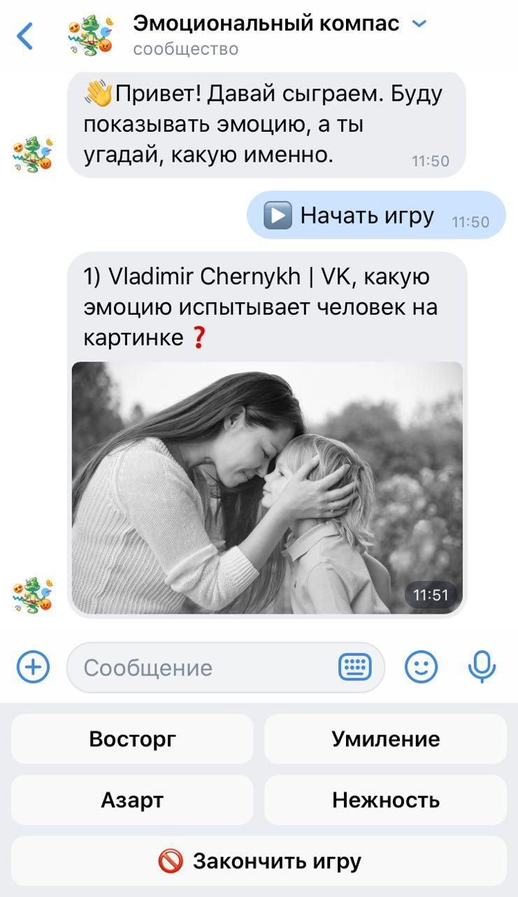
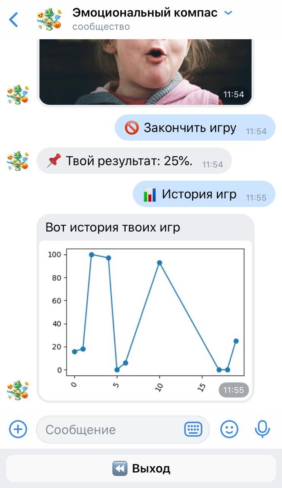

# Эмоциональный компас 2 (<a href='https://github.com/otter18/compass-in-the-world-of-emotions'>сслыка на версия 1</a>)
### Cыграть можно <a href="https://vk.com/emotional_compass">тут</a> (https://vk.com/emotional_compass)

- В нашей жизни эмоциональный интеллект проявляется как способность чувствовать свои эмоции, уметь ими управлять, понимать эмоции других людей.
- Часто очень умные люди с высоким IQ, испытывают проблемы в общении и построении взаимоотношений из-за низкого уровня эмоционального интеллекта.
- Мне, как и многим моим ровесникам, довольно сложно распознавать и называть свои эмоции. Поэтому я придумал простую компьютерную игру-тест, обучающую этому навыку. А потом создал ВК бота на ее основе для удобства использование в повседневной жизни.
### Игра-бот в ВК для развития эмоционального интеллекта
- Чтобы запустить код необходимо установить библотеки:
  <code>pip3 install -r requirements.txt</code>
 
- Пред запуском поместите свой vk-token в файл <code>config/token.txt</code>

## Скриншоты

<table>
  <tr>
    <td>Ход Игры</td>
     <td>Статистика по играм</td>
       </tr>
  <tr>
    <td></td>
    <td></td>
   
  </tr>
 </table>
