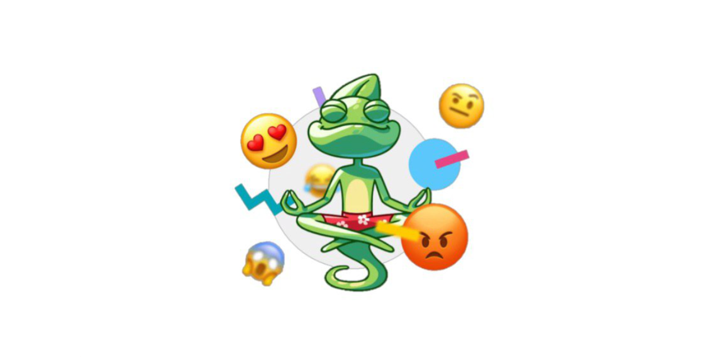

# Эмоциональный компас 2 

Это продолжение проекта с приложением на компьютер (https://github.com/otter18/compass-in-the-world-of-emotions)
### Игра-бот в ВК для развития эмоционального интеллекта
- Чтобы запустить код необходимо установить библотеки:
  <code>pip3 install -r requirements.txt</code>
 
- Пред запуском поместите свой vk-token в файл <code>config/token.txt</code>
## Попробовать сыграть можно <a href="https://vk.com/emotional_compass">тут</a> (https://vk.com/emotional_compass)
## Скриншоты

<table>
  <tr>
    <td>Ход Игры</td>
     <td>Статистика по играм</td>
       </tr>
  <tr>
    <td></td>
    <td></td>
   
  </tr>
 </table>
